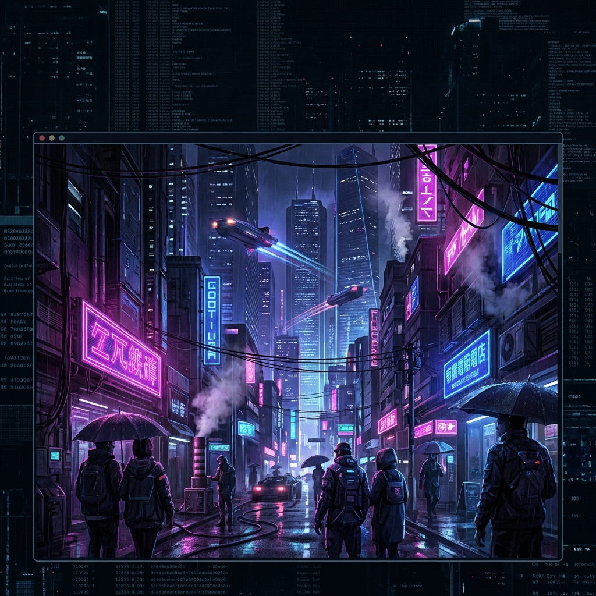
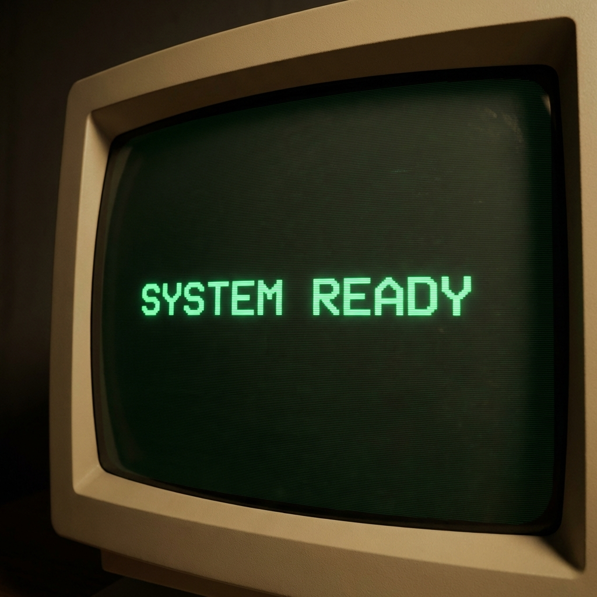
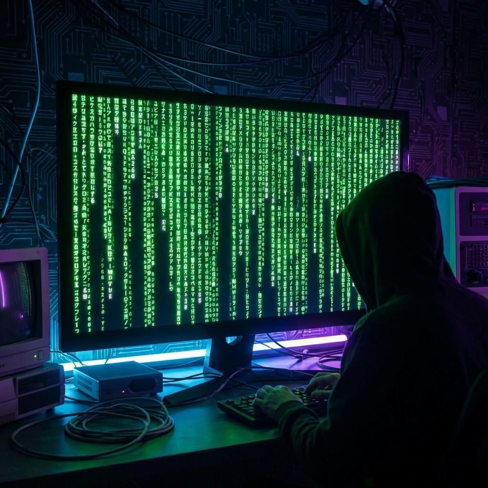
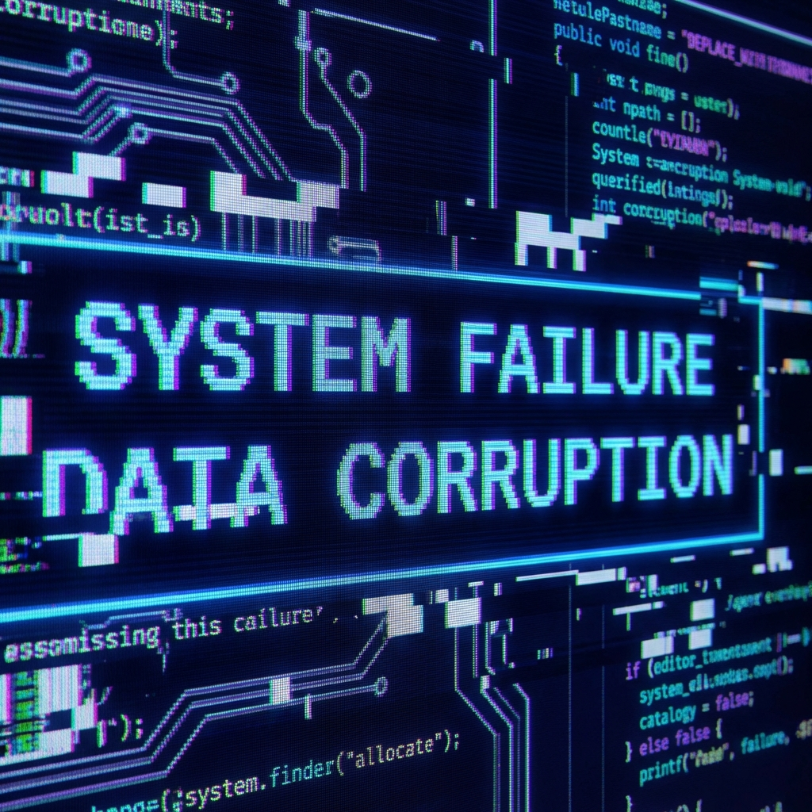
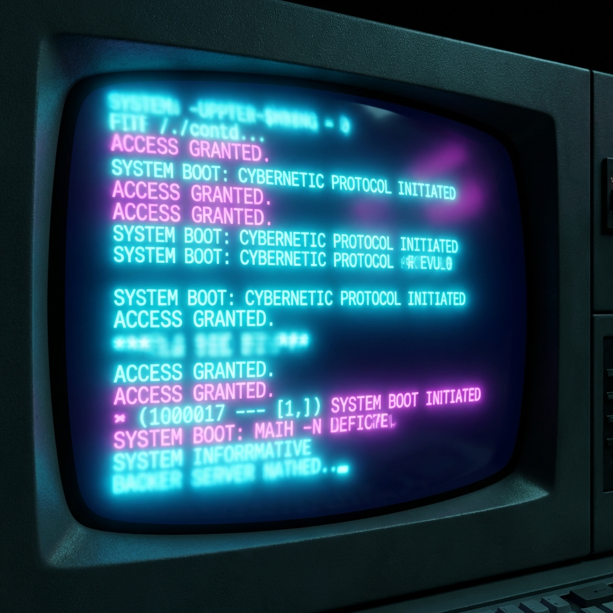
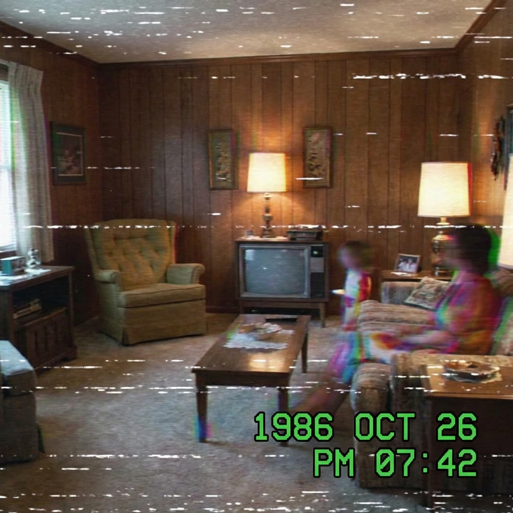
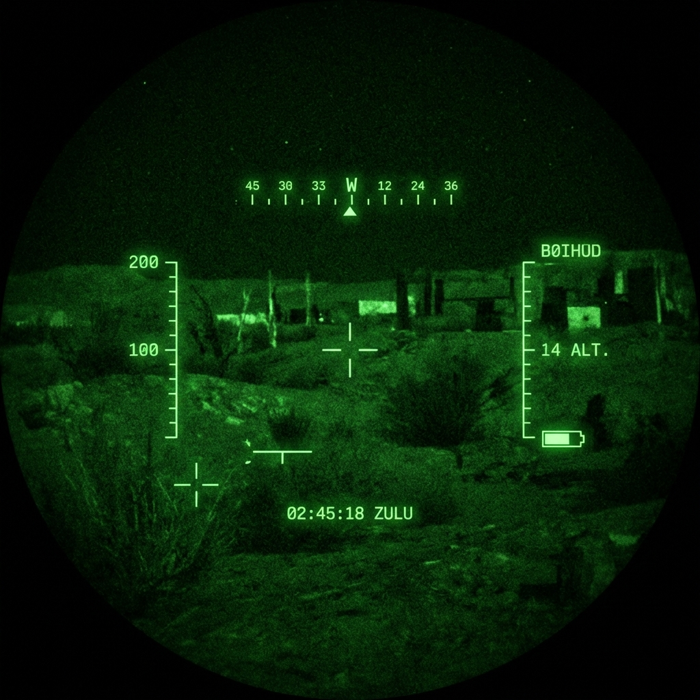
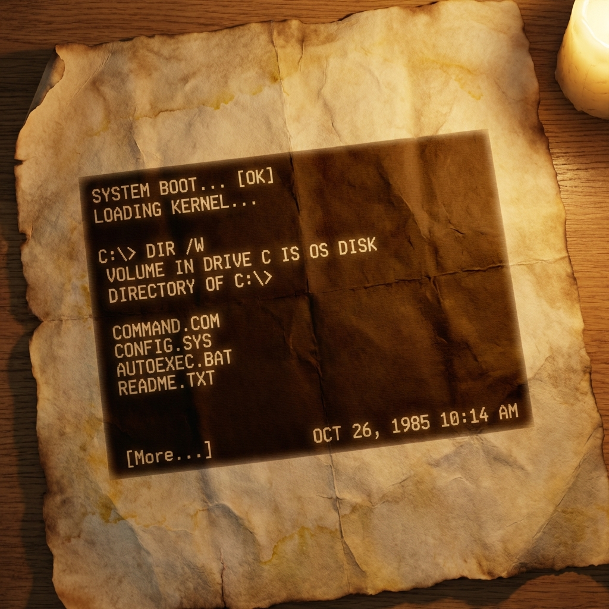
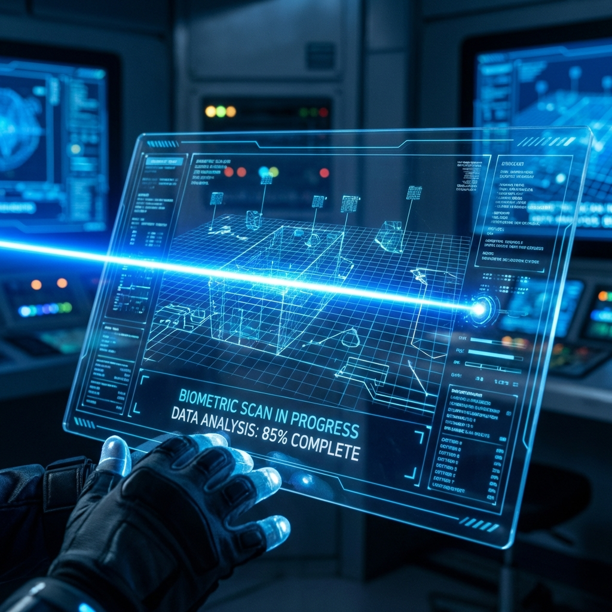

# Ultimate Terminal Manager 🚀

Make your terminal look **AMAZING** with one command.

This tool allows you to easily install custom themes, fonts, cursor effects, and **Shader FX** for Windows Terminal and Hyper.js.

## 🔥 Features
- **One-Click Presets**: Cyberpunk, Hacker, Matrix, Vaporwave, and more.
- **Custom Preset Wizard**: Build your own theme! Choose fonts, colors, cursors.
- **20+ Shaders**: Apply post-processing effects like CRT, Glitch, VHS, etc.
- **Automatic Setup**: Installs fonts, updates config files, and handles everything.

## 📦 How to Use
1. Right-click `Terminal-Manager.ps1` and select "Run with PowerShell".
2. Choose a preset from the menu.
3. Enjoy your new terminal!

## 🎨 Shader Gallery
We include over 20+ HLSL shaders to customize your Windows Terminal experience.

| Effect | Description | Preview |
| :--- | :--- | :--- |
| **Retro CRT** | Classic monitor scanlines and curvature |  |
| **Matrix** | Digital rain code (The One) |  |
| **Glitch** | Cyberpunk chromatic aberration & distortion |  |
| **Bloom** | Neon glow for bright colors |  |
| **VHS** | 80s tape tracking error and noise |  |
| **NightVision** | Tactical green phosphor military HUD |  |
| **Sepia** | Vintage paper / Old terminal look |  |
| **CyberScan** | Sci-Fi moving laser scanner |  |

### Other Available Shaders:
- **SobelEdge**: Glowing edge detection (Neon outlines)
- **Ripple**: Underwater wavy effect
- **Pixelate**: Low-res 8-bit retro gaming look
- **HueShift**: Psychedelic color cycling
- **Invert**: Negative colors
- **Grayscale**: Black & White noir style
- **FishEye**: Wide-angle lens distortion
- **RadialBlur**: Fast motion zoom effect
- **BlueTint / RedTint**: Cold or Emergency atmosphere

## 🛠️ Requirements
- Windows 10/11
- Windows Terminal
- PowerShell

## ⚠️ Note on Videos
Windows Terminal supports **Images (PNG, JPG)** and **GIFs** for backgrounds.
**MP4 Video files are NOT supported** as backgrounds in Windows Terminal (you will get a black screen). Please use GIFs instead!

---
*Created by MeklasDev*
